# 🐱 猫咪养护平台（Cat Platform）

# 📌 项目介绍

猫咪养护平台是一套基于 **前后端分离架构** 开发的公益类综合管理系统。

系统围绕流浪猫信息管理、猫咪养护、领养流程、志愿任务、社区交流以及公益募捐等业务场景展开，为管理员、志愿者以及普通用户提供完整的信息化管理服务。

项目采用：

- 后端：Spring Boot 架构
- 前端：Vue3 + Vite
- 数据库：MySQL

通过 RESTful API 实现前后端数据交互，并结合 JWT + Spring Security 实现用户认证和权限控制。


---

# 🎯 项目目标

随着流浪动物数量增加，传统人工记录方式存在信息分散、管理效率低、领养流程不规范等问题。

本项目旨在设计一个数字化猫咪养护管理平台，实现：

- 猫咪信息统一管理
- 领养流程线上化
- 志愿任务管理
- 用户社区互动
- 公益活动管理

提升猫咪救助工作的管理效率和信息透明度。


---

# 🏗️ 系统架构

项目采用前后端分离架构：

            浏览器
    
               |
    
      Vue3 + Element Plus
    
               |
    
          Axios 请求
    
               |
    
         RESTful API
    
               |
    
    Spring Boot 后端服务
    
      |                 |
     MySQL数据库       Redis缓存

---

# 🛠️ 技术栈


## 后端技术

| 技术 | 版本 / 作用 |
|----|----|
| Java | JDK 17 后端开发语言 |
| Spring Boot | 2.7.18 快速构建 Web 服务 |
| Spring Security | 登录认证、接口权限拦截 |
| JWT | 无状态 Token 身份校验 |
| MyBatis-Plus | 简化 CRUD、分页查询 |
| MySQL 8.0 | 业务持久化数据库 |
| Redis | 缓存支持 |
| Maven | 项目管理 |


## 前端技术

| 技术 | 说明 |
|-|-|
| Vue3 | 前端框架 |
| Vite | 构建工具 |
| Element Plus | UI组件库 |
| Axios | 网络请求 |
| Vue Router | 路由管理 |


---

# ✨ 功能模块


## 👤 用户模块

- 用户注册
- 用户登录
- 用户信息维护
- JWT身份认证
- 用户权限控制


## 🐱 猫咪管理模块

- 猫咪信息新增
- 猫咪信息编辑
- 猫咪信息删除
- 猫咪列表展示
- 猫咪详情查看
- 猫咪图片上传


## 🏠 领养管理模块

- 用户提交领养申请
- 查看领养状态
- 管理员审核申请
- 领养流程管理


## 📝 志愿任务模块

- 发布公益任务
- 查看任务列表
- 用户报名任务
- 任务状态管理


## 💬 社区交流模块

- 发布动态
- 查看社区内容
- 图片上传
- 用户互动


## 💰 公益募捐模块

- 创建募捐活动
- 查看募捐信息
- 捐赠记录管理


## 📢 公告管理模块

- 公告发布
- 公告展示
- 信息通知


---

# 🔐 权限认证设计


系统采用：

Spring Security + JWT

实现用户认证。

认证流程：

```
用户登录
↓
账号密码校验
↓
生成JWT Token
↓
前端保存Token
↓
请求携带Token
↓
后端过滤器验证权限
↓
访问接口
```


权限角色：

|角色|权限|
|-|-|
|普通用户|浏览信息、申请领养|
|志愿者|维护信息、参与任务、审核领养|
|管理员|用户管理、猫咪管理、审核管理、数据维护|


---

# 🗄️ 数据库设计


数据库：

cat_db


主要数据表：


| 数据表 | 说明 |
|-|-|
| user | 用户信息表 |
| cat | 猫咪信息表 |
| cat_photo | 猫咪图片表 |
| adoption_application | 领养申请表 |
| task | 志愿任务表 |
| donation | 捐赠记录表 |
| community | 社区动态表 |


数据库初始化：

执行：

```database/cat_db.sql```

即可完成数据库创建。


---

# 📂 项目结构

```
cat-platform-project
├── backend                 # SpringBoot后端
│   ├── src
│ 	│	└── main / resources / application-template.yml
│   ├── pom.xml
│   └── uploads                 # 图片上传目录
│   	├── agreements
│   	├── avatars
│   	├── cats
│   	├── community
│   	├── donations
│   	└── tasks
├── frontend                # Vue3前端
│   ├── public
│   ├── src
│   ├── index.html
│   └── package.json
├── database                # 数据库文件
│   └── cat_db.sql
├── docs                    # 项目文档及截图
│   ├── API.md              # 完整接口文档
│   ├── 猫咪领养协议.doc      # 领养猫咪协议模板
│   └── screenshots			# 项目截图
└── README.md
```


---

# 🚀 项目运行


## 1. 环境要求

JDK 17+
MySQL 8.0+
Node.js 18+
Maven 3.8+
Redis 6+

---

### 数据库部署
本项目使用 MySQL 8.0+（推荐8.0）
1. 找到项目目录下 ```database/cat_db.sql```
2. 打开 Navicat / DBeaver / MySQL命令行
3. 执行 `cat_db.sql` 文件
- 脚本会**自动创建 cat_db 数据库、数据表、导入初始演示数据**
- 脚本内置外键开关，导入不会出现外键顺序报错

> ⚠️ 重要注意：
> 数据库字符集：`utf8mb4`，排序规则 `utf8mb4_unicode_ci`
> 如果使用 MySQL5.7，功能基本兼容，若出现emoji乱码请核对数据库字符集

#### 系统测试账号（SQL内置，直接登录）

user数据库表中username为账号, 密码都是123456。

1. 管理员
账号：testuser  密码：123456
角色：ADMIN，拥有全部管理权限
2. 志愿者
账号：testvolunteer  密码：123456
角色：VOLUNTEER，可审核领养、处理志愿任务
3. 普通用户
账号：user  密码：123456
角色：USER，仅浏览、提交领养、发布动态
---

### 后端启动


进入：

```backend```


修改：

```src/main/resources/application-template.yml```


配置：

```yaml
spring:
  datasource:
    url: jdbc:mysql://localhost:3306/cat_db?useUnicode=true&characterEncoding=utf-8&serverTimezone=Asia/Shanghai&allowMultiQueries=true
    username: root
    password: your_password   # 你的MySQL密码

# JWT认证配置，务必替换secret为自定义随机字符串
jwt:
  secret: your-256-bit-secret-your-256-bit-secret  # 至少32个字符，建议用随机字符串
  expiration: 86400000  # 24小时，单位毫秒
```

配置好后复制模板并重命名为 application.yml

启动：
命令行：```mvn spring-boot:run```
或者 IDEA 运行：
```CatPlatformApplication```  主类

后端地址：
http://localhost:8080

注意：

1. 文件上传使用项目相对路径，无需修改盘符，克隆项目自带uploads文件夹即可使用。

2. 如果想把uploads文件夹放在其他地方，可以自行在application.yml文件中修改。

   ```
   # 文件上传配置
   file:
     upload:
       base: ./uploads/
   #    base: 你电脑上的uploads文件地址         
   #    可修改，想把文件转移到哪就填哪
   ```

---

### 前端启动

进入：
```frontend```

复制 `.env-template`，副本重命名为 `.env` 

修改 `.env`： 

前往高德开放平台申请Web端密钥，替换 `VITE_AMAP_KEY`、`VITE_AMAP_SECURITY_KEY`

安装依赖：

```
yarn install
```
启动：
```
yarn dev
```
访问：
http://localhost:5173

注意：

​	后端接口地址已写死为`http://127.0.0.1:8080`，若后端端口修改，请在前端代码中修改接口请求地址。

# 📦 文件上传设计

系统采用本地文件存储方式。
目录：

```
uploads

├── avatars		#用户头像图片

├── cats		#猫咪图片

├── community	#动态图片

├── donations	#捐赠凭证图片

└── tasks		#任务完成证明图片
```
> ⚠️ 克隆项目后请勿删除 uploads 文件夹，内部存放演示图片资源；
> 线上生产环境建议替换阿里云 / 腾讯云对象存储，避免本地磁盘存储限制。

# 🔌 接口设计

## 接口规范

系统采用 RESTful API 设计规范，前后端通过 HTTP 协议进行数据交互。
接口统一前缀：

```
/api
```

后端服务地址：

```
http://localhost:8080
```

前端通过 Axios 统一封装请求，实现：

- 请求拦截
- Token自动携带
- 统一异常处理
- 响应数据解析

登录后，请求头自动携带 JWT：

```
Authorization: Bearer <token>
```

接口统一返回格式：

```
{
    "code":200,
    "message":"success",
    "data":{}
}
```

其中：

| 字段    | 说明       |
| ------- | ---------- |
| code    | 业务状态码 |
| message | 提示信息   |
| data    | 业务数据   |

## 接口模块设计

系统后端 API 按业务功能划分为多个模块：

```
API

├── 用户认证模块
│
├── 猫咪管理模块
│
├── 领养管理模块
│
├── 志愿任务模块
│
├── 社区互动模块
│
├── 公告管理模块
│
├── 公益募捐模块
│
├── 通知消息模块
│
├── 健康记录模块
│
└── 猫咪位置模块
```

接口覆盖用户端、志愿者端以及管理员后台的业务需求。

## 核心接口示例

### 1.用户认证接口

用户登录

  ```
  POST /api/user/login
  ```

  请求：

  ```
  {
   "username":"testuser",
   "password":"123456"
  }
  ```

  返回：

  ```
  {
   "code":200,
   "message":"success",
   "data":{
       "token":"xxxxx"
   }
  }
  ```


  登录成功后，前端保存 Token，并用于后续身份认证。

### 2.猫咪管理接口

| 功能         | 方法   | 接口                           |
| ------------ | ------ | ------------------------------ |
| 查询猫咪列表 | GET    | /api/cats                      |
| 查看猫咪详情 | GET    | /api/cats/{id}                 |
| 新增猫咪档案 | POST   | /api/cats                      |
| 修改猫咪信息 | PUT    | /api/cats/{id}                 |
| 删除猫咪信息 | DELETE | /api/cats/{id}                 |
| 上传猫咪照片 | POST   | /api/cat-photos/upload/{catId} |

### 3.领养流程接口

  系统实现完整领养业务流程：

  ```
  1. 用户申请
  
  ↓
  
  志愿者初审
  
  ↓
  
  线下回访
  
  ↓
  
  管理员终审
  
  ↓
  
  签订协议
  
  ↓
  
  完成领养
  ```

  主要接口：

|   功能   | 方法 | 接口 |
| ---- | ---- | ---- |
| 提交申请 | POST | /api/adoptions/apply |
| 查询申请 | GET | /api/adoptions/page |
| 初审 | PUT | /api/adoptions/{id}/first-review |
| 终审 | PUT | /api/adoptions/{id}/final-review |
| 上传协议 | PUT | /api/adoptions/{id}/sign-agreement |
| 完成领养 | PUT | /api/adoptions/{id}/complete |

### 4. 志愿任务接口

支持任务创建、报名、分配、执行、审核完整流程。


| 功能 | 方法 | 接口 |
| :--- | :--- | :--- |
| 任务列表 | GET | `/api/tasks` |
| 发布任务 | POST | `/api/tasks` |
| 报名任务 | POST | `/api/tasks/{taskId}/apply` |
| 自动分配志愿者 | POST | `/api/tasks/{taskId}/auto-assign` |
| 提交完成 | POST | `/api/tasks/{taskId}/complete` |
| 审核完成 | PUT | `/api/tasks/{taskId}/review-completion` |


---

### 5. 社区互动接口

支持用户发布动态、点赞、评论以及管理员内容管理。


| 功能 | 方法 | 接口 |
| :--- | :--- | :--- |
| 动态列表 | GET | `/api/community/posts` |
| 发布动态 | POST | `/api/community/posts` |
| 点赞 | POST | `/api/community/posts/{id}/like` |
| 发表评论 | POST | `/api/community/comments` |
| 上传图片 | POST | `/api/community/upload` |


---

### 6. 公益募捐接口

支持募捐活动管理以及捐赠记录管理。


| 功能 | 方法 | 接口 |
| :--- | :--- | :--- |
| 募捐列表 | GET | `/api/donations/campaigns` |
| 创建活动 | POST | `/api/donations/campaigns` |
| 提交捐赠 | POST | `/api/donations/donate` |
| 查询记录 | GET | `/api/donations/records` |
| 统计分析 | GET | `/api/donations/statistics` |

## 接口设计特点

✅ RESTful 风格接口设计
✅ 前后端接口分离
✅ JWT Token 身份认证
✅ Spring Security 权限控制
✅ 统一响应结构
✅ 文件上传接口支持 multipart/form-data
✅ 按业务模块划分 Controller
✅ 支持普通用户、志愿者、管理员多角色访问
完整接口文档：

```
docs/API.md
```

---

# 📷 项目截图

- 登录页面
- 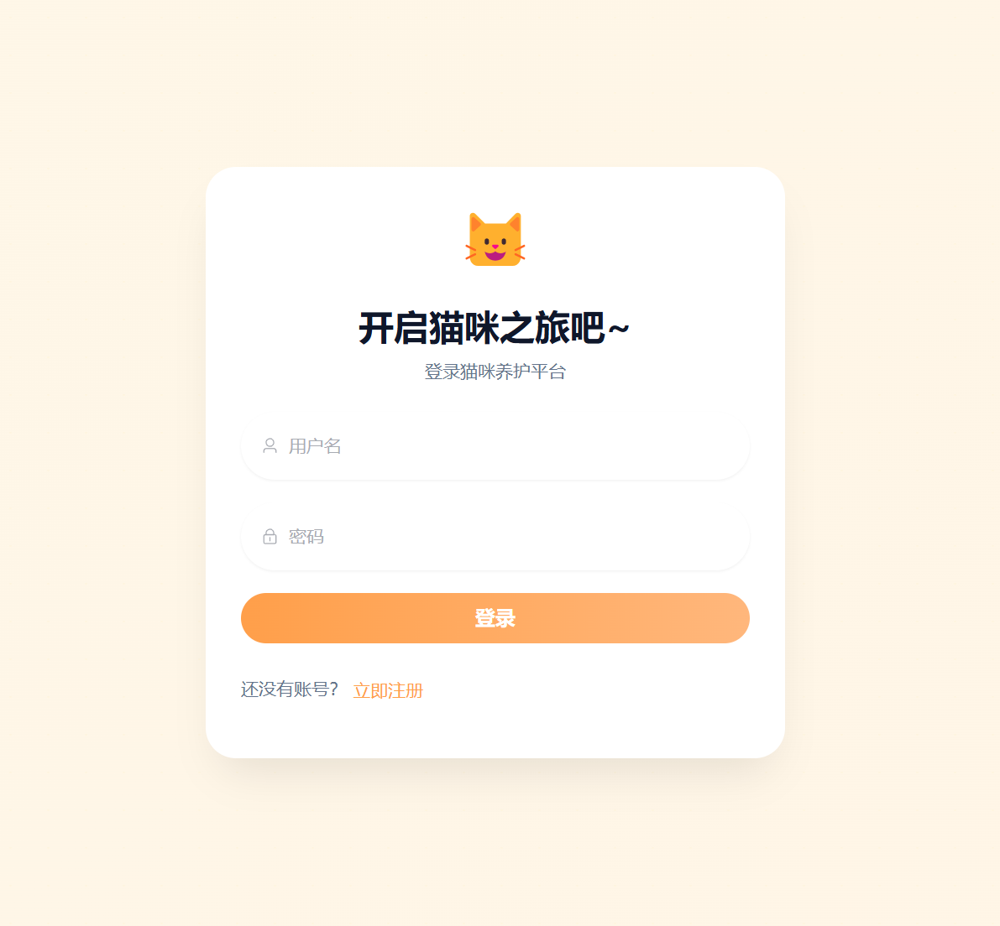
- 平台首页
- 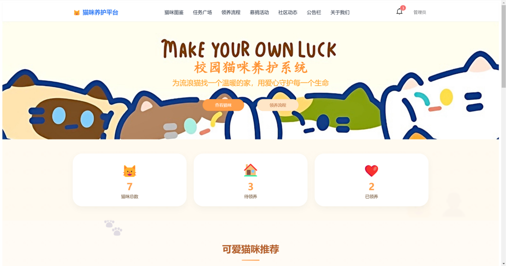
- 猫咪信息页面
- 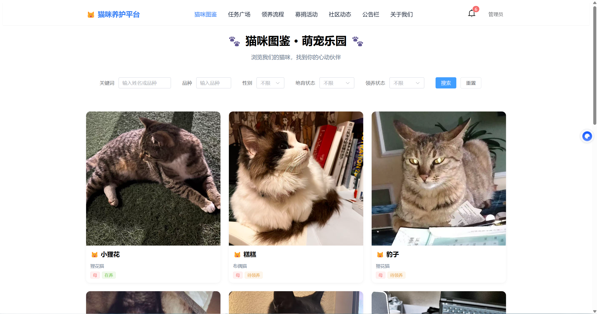
- 猫咪详情页面
- 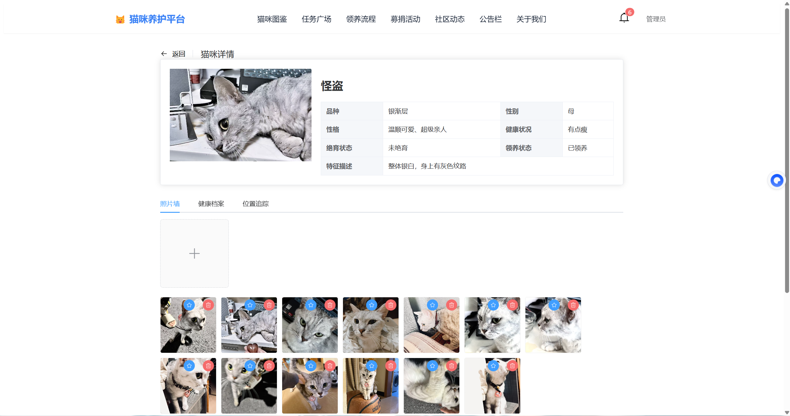
- 任务列表页面
- 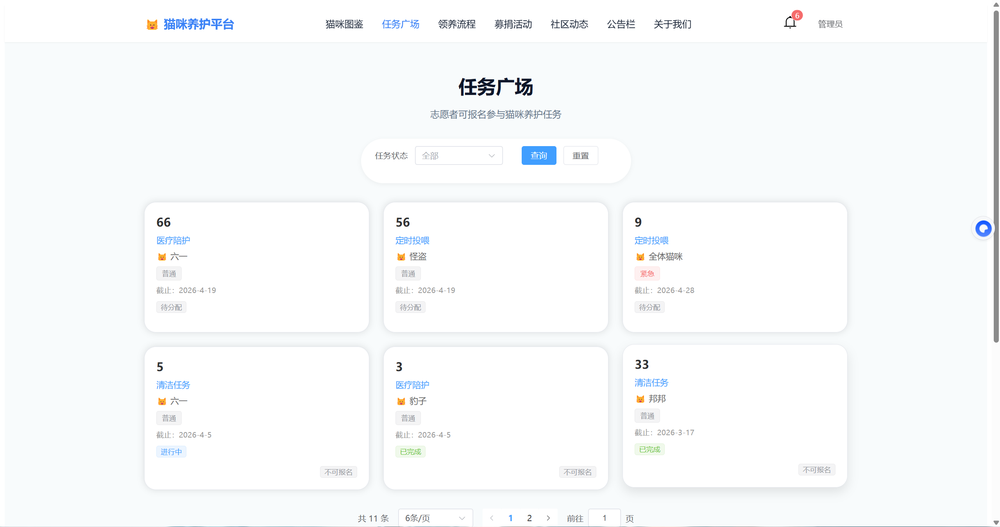
- 领养流程页面
- 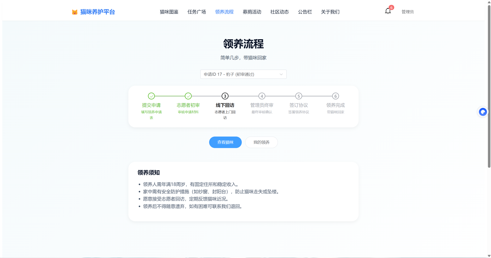
- 募捐列表页面
- 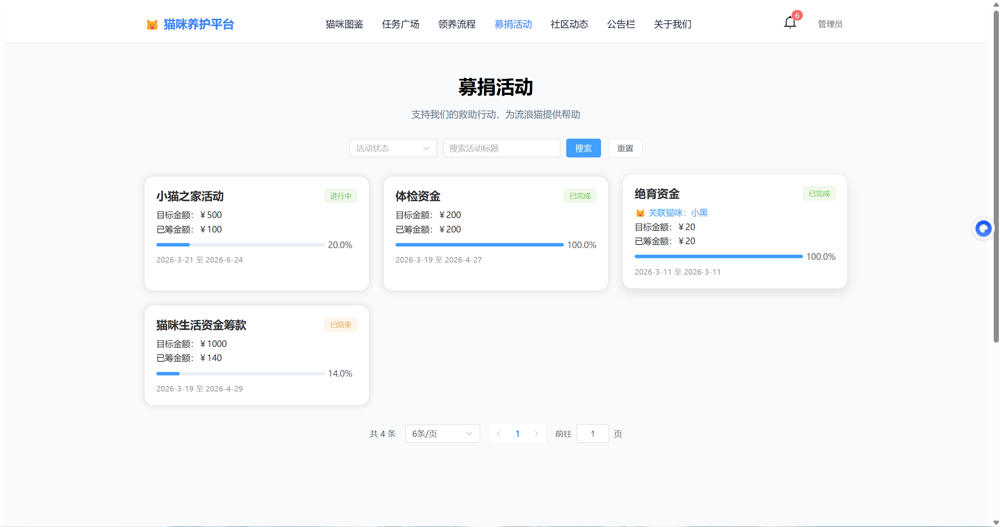
- 社区动态页面
- 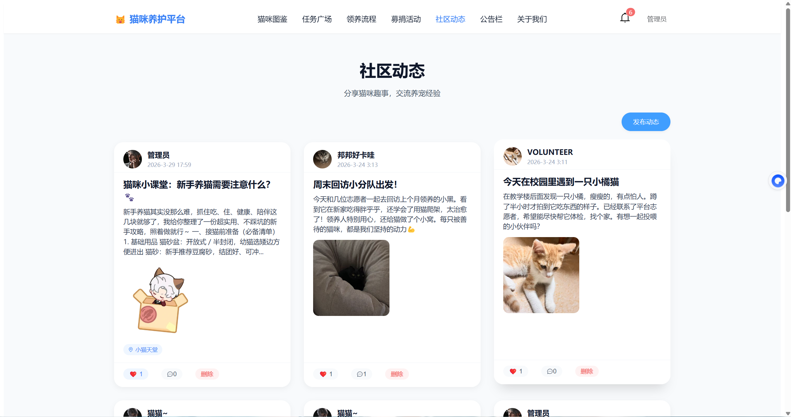
- 公告栏页面
- 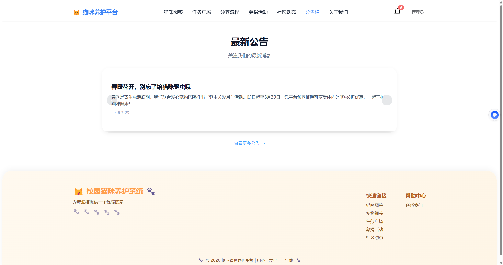
- 个人中心页面
- 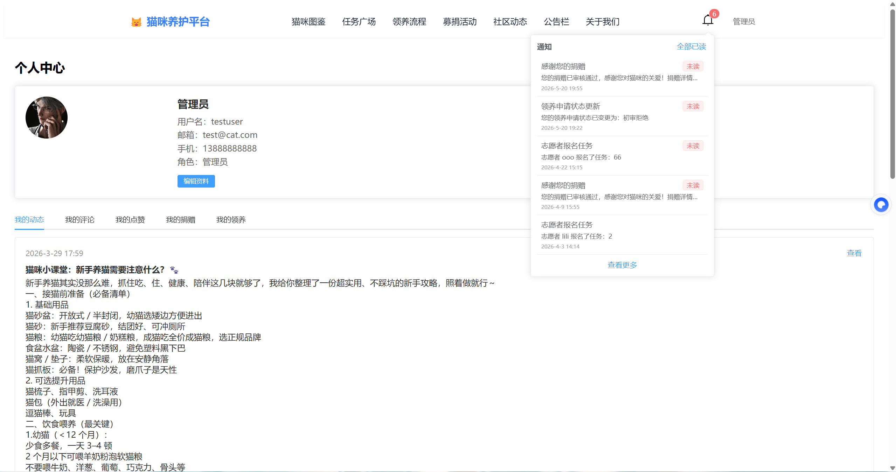
- 管理后台页面
- 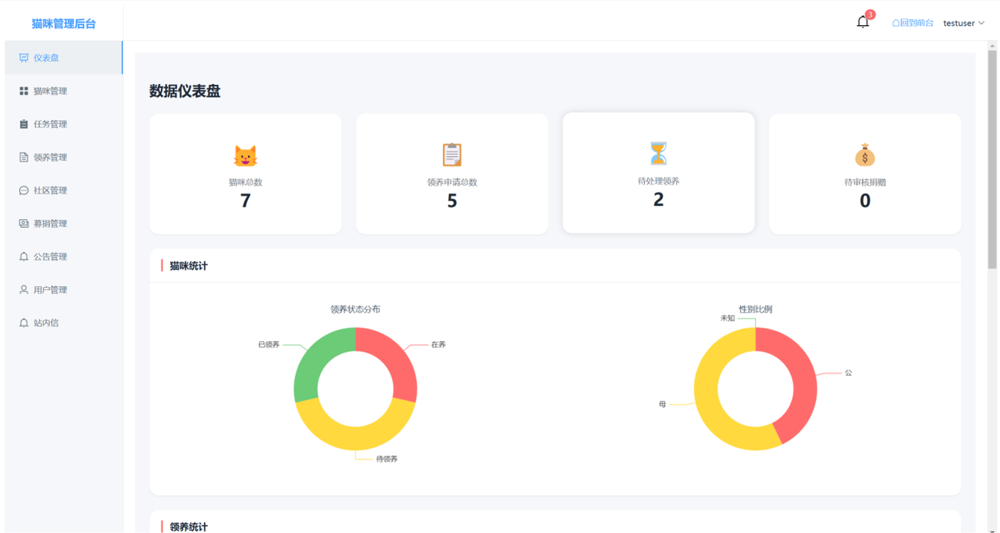

# 🔧 后续优化方向

使用 Redis 缓存热点数据

使用 Docker 容器化部署

使用 Nginx 部署前端

使用对象存储替代本地文件（双实现类：本地存储 + MinIO），配置文件切换

所有 Controller 移除 System.out，全部替换 Slf4j 日志

定时任务清理数据库未引用的垃圾图片

增加文件大小、类型校验，防止上传恶意文件

# 🧩 开发难点与解决方案
1. 多角色权限区分（普通用户/志愿者/管理员）
   问题：不同页面、接口需要精细化权限拦截，手写判断冗余
   方案：SpringSecurity 自定义权限注解 + JWT过滤器，接口通过注解控制访问角色，统一拦截无权限请求。
2. 领养完整业务流程多状态流转
   问题：领养11种状态，流程复杂，容易出现状态跳转混乱
   方案：后端枚举统一管理状态，每次审核操作做状态合法性校验，非法操作直接抛出全局异常。
3. 多类型文件统一上传（头像、猫咪图、协议、凭证）
   问题：不同业务图片路径混乱、重复代码多
   方案：封装统一文件上传工具类，自动按业务分类存入uploads对应子文件夹，统一返回访问URL。
4. 外键关联表导入SQL报错
   方案：导出SQL时增加 SET FOREIGN_KEY_CHECKS 开关，导入临时关闭外键校验，避免建表顺序问题。

# 📖 项目亮点

✅ 前后端分离开发模式
✅ Spring Security + JWT认证
✅ RESTful API接口设计
✅ MyBatis-Plus快速开发
✅ Vue3组件化开发
✅ 完整业务流程设计
✅ 数据库结构设计

---

# 📜 开源声明
本项目为个人毕业设计，仅用于学习、面试演示，禁止直接抄袭作为课程设计/毕业设计提交；
禁止商用，如需二次学习请标注原作者仓库地址。

---

# 👨‍💻 作者
开发：Wen Jiaxin
用途：本科毕业设计 & 求职全栈项目演示
GitHub：当前仓库链接

